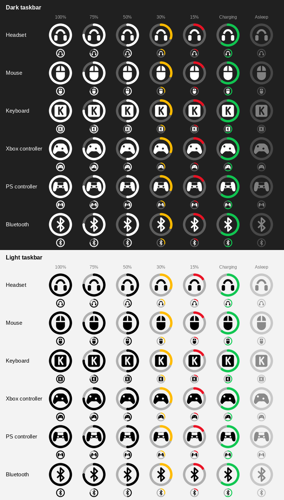

# Halo Battery

Battery levels for wireless mice, keyboards, headsets and controllers in the Windows system tray - one icon per device, no vendor software.

While charging, the arc slowly "breathes":

Each device gets its own tray icon: a battery ring with the device's pictogram in the middle. The arc fills clockwise from the top, turns amber as the level approaches your alert threshold and red at or below it, and breathes green while the device charges. Hover over an icon for the exact percentage; right-click it to rename, hide, change the preferences or take a diagnostics report.

Levels are read over USB/HID (a dongle, a receiver or a cable), from Xbox-style controller reports, and from Windows itself for Bluetooth devices.

## Supported devices

`yes` - confirmed on real hardware (here, by a reporter, or by users who tried it) · `no` - written from a reference implementation and not yet confirmed on hardware. Each device links to its implementation notes in [docs/protocols.md](docs/protocols.md).

| Device | Connection | Protocol | Verified on hardware |
|---|---|---|---|
| [Astro A50 Gen 5 (Logitech 046D:0B1C)](docs/protocols.md#astro-a50-gen-5-logitech-046d0b1c) | Base station | `0xFF32` vendor collection, `02 0c` frames, command `0x06` | no |
| [ASUS ROG Gladius III Aimpoint and other ROG / TUF wireless mice (list in `providers/asus.py`)](docs/protocols.md#asus-rog-gladius-iii-aimpoint-and-other-rog--tuf-wireless-mice) | 2.4 GHz receiver or USB cable (for example 0B05:1A72) | G-Helper's `12 07` on report 0 | no |
| [Audeze Maxwell](docs/protocols.md#audeze-maxwell) | 2.4 GHz dongle (3329:4B19) and USB-C cable (3329:4B1A) | vendor `0xFF13`, attribute `0x0CD6` | yes |
| [Bluetooth devices, tested on the 1MORE SonoFlow headset (users also report Audio-Technica and JBL Tune 760NC headphones working)](docs/protocols.md#bluetooth-devices-tested-on-the-1more-sonoflow-headset) | Bluetooth (on by default, can be turned off in the menu) | the level Windows itself reports | yes |
| [Corsair Void v2 Wireless, Virtuoso Max Wireless, HS80 Max Wireless](docs/protocols.md#corsair-void-v2-wireless-virtuoso-max-wireless-hs80-max-wireless) | Wireless receiver (1B1C:2A08, 1B1C:2A02, 1B1C:0A97) | vendor interface 4, command `0x0F`, hundredths of a percent | no |
| [GameSir G7 Pro; FlyDigi Vader Pro (tested by users)](docs/protocols.md#gamesir-g7-pro-flydigi-vader-pro) | 2.4 GHz receiver (shows up as an Xbox controller) | Windows.Gaming.Input, XInput fallback | yes |
| [G-Wolves WARG, HTS Plus (Pro), HTXU, Lycan, Fenrir Pro / Asym, HTX Mini](docs/protocols.md#g-wolves-warg-hts-plus-pro-htxu-lycan-fenrir-pro--asym-htx-mini) | 8K receiver (33E4:3854) or USB cable | same exchange as the WLmouse mice | no |
| [HyperX Cloud II Wireless](docs/protocols.md#hyperx-cloud-ii-wireless) | 2.4 GHz dongle (03F0:0696, and 03F0:018B on the newer dongle revision) | vendor `0xFF90`, commands `0x02`/`0x03` | no |
| [HyperX Cloud III Wireless](docs/protocols.md#hyperx-cloud-iii-wireless) | 2.4 GHz dongle (03F0:05B7, and 03F0:0C9D which the reference also lists) | vendor `0xFF13`, `66` packet | no |
| [JBL Quantum 910 Wireless](docs/protocols.md#jbl-quantum-910-wireless) | 2.4 GHz dongle (0ECB:2088) | event report `0x08` on `ff13:0001` | yes |
| [Keychron Ultra-Link 8K, Keychron M5](docs/protocols.md#keychron-ultra-link-8k-keychron-m5) | 2.4 GHz receiver (3434:D028) and USB cable (3434:D048) | feature `b3 06`, reply `b4 06` | no |
| [LAMZU Maya X](docs/protocols.md#lamzu-maya-x) | 8K dongle (373E:001E) or USB cable (373E:001C) | the WLmouse `02 02 00 83` exchange, collection `ffff:0000` | no |
| [Lofree Hyzen](docs/protocols.md#lofree-hyzen) | 2.4 GHz dongle (388D:0025) | the web driver's `AA`/`1A` on report `0x04` | no |
| [Logitech G502 LIGHTSPEED, G502 X PLUS](docs/protocols.md#logitech-g502-lightspeed-g502-x-plus) | Lightspeed receiver (046D:C539, 046D:C547) | HID++ 2.0 battery features | yes |
| [MCHOSE A7 V2 Ultra](docs/protocols.md#mchose-a7-v2-ultra) | 2.4 GHz receiver (3837:100B, RealTek strings) | the M7 Ultra protocol, report `0x11` | no |
| [MCHOSE G7](docs/protocols.md#mchose-g7) | USB (A8A5:2255, chip 'YJX-CHIP') | `AA 30` input report | yes |
| [MCHOSE M7 Ultra](docs/protocols.md#mchose-m7-ultra) | 2.4 GHz receiver (5253:1020) | vendor `0xFF01`, report `0x11` or `0x12` | yes |
| [Nintendo Switch Pro Controller, Joy-Con (L) / (R)](docs/protocols.md#nintendo-switch-pro-controller-joy-con-l--r) | Bluetooth (057E:2009, 2006, 2007) | input report, level 0-8 | no |
| [Pulsar X2 V2 Mini, ATK VXE R1 SE+, VXE R1 Pro Max](docs/protocols.md#pulsar-x2-v2-mini-atk-vxe-r1-se-vxe-r1-pro-max) | 2.4 GHz dongle (3554:F508, 373B:1085, 3554:F58A) and USB cable (3554:F507, 3554:F58F, 3554:F58C) | 17-byte `0x08` frames, command `0x04` | no |
| [Razer Barracuda Pro (2.4 GHz)](docs/protocols.md#razer-barracuda-pro-24-ghz) | 2.4 GHz dongle (1532:053a) | Razer `PA` protocol, battery `0x21` | yes |
| [Razer Basilisk V3 Pro, Razer Basilisk Ultimate (tested by users)](docs/protocols.md#razer-basilisk-v3-pro-razer-basilisk-ultimate) | 2.4 GHz receiver | Razer `0x07`/`0x80` feature report | yes |
| [Razer BlackShark V2 Pro (2023)](docs/protocols.md#razer-blackshark-v2-pro-2023) | 2.4 GHz receiver (1532:0555) | Razer `PA`, report `0x02` on `0xFF00` | yes |
| [Razer DeathAdder V4 Pro](docs/protocols.md#razer-deathadder-v4-pro) | 2.4 GHz receiver (1532:00BF) | Razer `0x07`/`0x80`, transaction `0x1F` | yes |
| [Sony DualSense (PS5)](docs/protocols.md#sony-dualsense-ps5) | USB or Bluetooth | HID input report | yes |
| [Sony DualShock 4 (PS4)](docs/protocols.md#sony-dualshock-4-ps4) | USB cable and Bluetooth (054C:09CC) | HID input report | yes |
| [SteelSeries Aerox 3 Wireless](docs/protocols.md#steelseries-aerox-3-wireless) | 2.4 GHz dongle (1038:1838) | `00 aa 01` on `0xFFC0` | no |
| [SteelSeries Arctis Nova 7](docs/protocols.md#steelseries-arctis-nova-7) | 2.4 GHz dongle (1038:22A1) | `00 b0` on `0xFFC0` | yes |
| [SteelSeries Arctis Nova Pro Wireless (`1038:12E0`, `1038:12E5` X)](docs/protocols.md#steelseries-arctis-nova-pro-wireless-103812e0-103812e5-x) | Wireless base station, interface 3 or 4 | `b0` asked with report `06`, nine-step level | no |
| [SteelSeries Rival 3 Wireless](docs/protocols.md#steelseries-rival-3-wireless) | 2.4 GHz dongle (1038:1830) | `00 aa 01` on `0xFFC0` | no |
| [WLmouse Beast X Max](docs/protocols.md#wlmouse-beast-x-max) | 8K receiver (36A7:A880) and USB cable | feature report `02 02 00 83` | yes |

**PlayStation controllers over Bluetooth:** a DualShock 4 or DualSense sends its battery level over Bluetooth only in its "full report" mode. Switching a controller into that mode makes it invisible to games that use DirectInput until it is turned off and on again (#96), so the app does not switch it: the level shows while Steam or a game has already put the controller in that mode, and otherwise the icon shows the controller without a level. If you do not play such games, turn on **Preferences > PlayStation full mode (Bluetooth)** to always see the level. Over USB the level is always shown.

**Compatible, not tested.** The code reads these with the same paths as the devices above, but nobody has confirmed them on hardware yet:

- **Razer** wireless mice whose battery OpenRazer reads: Pro Click, Pro Click V2 and V2 Vertical, Naga, Viper, DeathAdder, Basilisk, Mamba, Lancehead and others - the `KNOWN` list in `providers/razer.py` holds the full set.
- **WLmouse**: the Beast X and Beast X Mini Pro, the same feature-report exchange as the Beast X Max.
- **Logitech**: most other HID++ 2.0 mice and keyboards on a Lightspeed, Unifying or Bolt receiver, and the G533, G535, G633, G635, G733, G933, G935, G PRO and G PRO X headsets.
- **SteelSeries**: the other Arctis Nova 7 and Nova 5 models, and the older Arctis 1, 7, 9, Pro Wireless, 7+ and GameBuds as HeadsetControl documents them.
- **Xbox-compatible controllers**: read the same way as the GameSir G7 Pro.
- **Bluetooth**: any device whose battery level Windows itself reports.

Support for other devices is not guaranteed. New devices are added based on feedback and diagnostics logs: if yours is not detected or shows a wrong level, open an issue and attach the diagnostics report - see **Troubleshooting** below.

Two limitations of the Maxwell support are worth stating rather than leaving to be discovered. Two Maxwells on one machine share a single icon: both endpoints report the serial `0000000000000000`, so nothing distinguishes them over HID and only the first one is read. And the Xbox cable PID (`3329:4B1E`) is derived from the Xbox dongle (`3329:4B18`) by the same +1 offset that separates the PC dongle `3329:4B19` from its cable `3329:4B1A` — it has not been measured against an Xbox model, so an Xbox cable may be read as `3329:4B18` and shown as not charging.

## Installation

### Option 1: the ready-made .exe (recommended)

1. Download `HaloBattery-<version>.zip` from the [Releases](../../releases/latest) page.
2. Extract it somewhere permanent, e.g. `C:\Tools`, so you get `C:\Tools\HaloBattery\HaloBattery.exe`, and run `HaloBattery.exe`. Keep the `HaloBattery` folder together: the .exe needs the `_internal` folder next to it.
3. Right-click the tray icon → **Start with Windows**.

The app checks for a new release once a day and adds **Download vX.Y.Z…** to the menu when there is one. To update: tray menu → **Exit**, then replace the folder; **Start with Windows** follows the new copy. If you used the old single-file `HaloBattery.exe`, delete it.

Windows SmartScreen may warn about an unrecognized app on first launch, because the file is not code-signed: **More info → Run anyway**. Some antivirus tools flag unsigned Python apps by mistake (usually a generic `!ml` detection). The release is built by GitHub Actions straight from this repository, with public build logs; if you would rather not trust it, use Option 2.

### Option 2: from source

1. Install [Python 3.10+](https://www.python.org/downloads/) with **Add python.exe to PATH** checked.
2. Download or clone this repository somewhere permanent, e.g. `C:\Tools\HaloBattery`.
3. Run `install_and_run.bat`, then right-click the tray icon → **Start with Windows**.

`build_exe.bat` builds it yourself into `dist\HaloBattery`. Releases are built automatically: pushing a tag like `v1.8.0` makes GitHub Actions build the app and attach the zip (`.github/workflows/release.yml`).

## The icon

- **Centre**: a headset, a mouse, a keyboard (a keycap with a K), an Xbox or PlayStation controller, or the Bluetooth rune - the pictogram can be turned off in the menu.
- **Colour**: follows the taskbar (white on a dark bar, black on a light one). With [MyDockFinder](https://store.steampowered.com/app/1787090/MyDockFinder/) running it follows its top menu bar instead. With a transparent taskbar (e.g. TranslucentTB) pick **Icon colour → White** or **Black**.
- **Amber**: close to the alert threshold. **Red**: at or below it.
- **Green and breathing**: charging - the animation can be turned off in the menu, leaving a plain green arc.
- **Translucent**: the mouse is asleep and keeps its last level for 5 minutes. A device that is switched off leaves the tray and comes back when it is switched on.

The low battery notification fires once, and again only after the device has been charged.

## Tray menu

Right-click a device icon to open its menu. It looks like a Windows 11 menu (acrylic background, rounded corners, the light or dark app theme) and is sharp at any display scale. If it does not work on your PC, set `"fluent_menu": false` in `%APPDATA%\HaloBattery\config.json` to get the classic Windows menu back.

- **Rename…**: give the device your own name (for example, two controllers with the same name). **Reset name** goes back to the device's own name.
- **Icon**: pick the pictogram of this device (Automatic, Mouse, Keyboard, Headset, Controller or Bluetooth), for example a controller over Bluetooth that shows the Bluetooth pictogram.
- **Hide this device**: remove its icon, for example for a controller that always reports 100%.
- **Refresh now**
- **Preferences**:
  - **Poll interval** (15 s to 5 min) and **Low battery alert** (off, 10–30%): change them with the − and + buttons or the mouse wheel, the menu stays open
  - **Alert when fully charged** (a notification once per charge, on by default)
  - **Windows Bluetooth devices**, **Device pictogram**, **Charging animation**
  - **PlayStation full mode (Bluetooth)** (off by default): always read the battery of a PS4 / PS5 controller over Bluetooth. Some games stop seeing the controller in that mode until it is turned off and on
  - **Icon colour**: Automatic (the Windows theme, or MyDockFinder's menu bar while it is running), White or Black
  - **Start with Windows** (per-user registry key, no admin rights needed)
  - **Check for updates**: once a day, on by default; a notification and a **Download vX.Y.Z…** item appear when a new release is out
- **Hidden devices** (only when a device is hidden): click a device to show it again
- **Diagnostics…**: writes a detailed report and opens it

## Troubleshooting

1. Close Synapse, the WLmouse web driver and other battery tools - they may hold the receiver.
2. Wake the mouse up by moving it.
3. Run `probe.bat` or choose **Diagnostics…** from the tray menu. The report lists every HID device and the raw protocol replies; attach it to an issue in this repository to get a new device supported. It contains Bluetooth MAC addresses and device serial numbers - redact them if you want to.
4. **"python312.dll was not found"**, or **Start with Windows** says the app runs from a temporary folder: the app was started straight from the ZIP, or only `HaloBattery.exe` was copied out of it. Extract the whole ZIP to a permanent folder and start the app from there.

Settings, the log and the diagnostics report live in `%APPDATA%\HaloBattery`.

## Credits

- WLmouse protocol: @len0c ([incconutwo/mouse-battery-tray](https://github.com/incconutwo/mouse-battery-tray), MIT).
- MCHOSE protocol: the write-up by @alexfrih ([alexfrih/mchose-linux](https://github.com/alexfrih/mchose-linux), recovered from MCHOSE's own web driver); the G7 from @kek353's monitor and the dump in [#8](https://github.com/HeyOkay/HaloBattery/issues/8).
- BlackShark V2 Pro 2023: the OpenRazer driver ([PR #2862](https://github.com/openrazer/openrazer/pull/2862)). Razer PIDs and transaction ids: OpenRazer and [RazerBatteryTaskbar](https://github.com/Tekk-Know/RazerBatteryTaskbar).
- The reference implementations behind individual devices - HeadsetControl, rivalcfg, Solaar, G-Helper, HyperHeadset, mouse.xyz, [`@openmouse/protocol`](https://github.com/OpenMouse-Project/openmouse), keychron-battery-dkms, JBL_Baterry_Monitor and others - are credited next to the device they were used for in [docs/protocols.md](docs/protocols.md).

## License

MIT, see [LICENSE](LICENSE).
